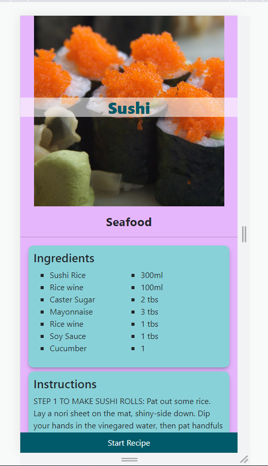
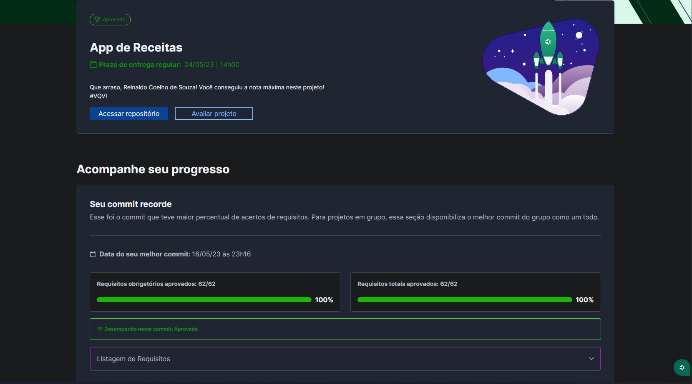

# 🥗 CookScript

## 📘 Sobre

Aplicativo de receitas em React.js

## 🧩 Funcionalidades

- Simular um login;
- Ter acesso a uma variedade de receitas de comidas e/ou bebidas;
- Filtrá-las por tipo;
- Conferir detalhes de uma receita (ingredientes, instruções, vídeos explicativos);
- Iniciar uma receita e controlar o andamento marcando quais ingredientes já foram usados;
- Finalizar uma receita;
- Adicionar uma receita aos favoritos;
- Visualizar o perfil e acessar as receitas feitas, favoritadas e em progresso.

## ⚛️ Ferramentas

Projeto construído utilizando React.js.

- JavaScript;
- Context API;
- Componentes Funcionais;
- React Router;
- useState, useEffect, useHistory, etc;
- Requisição de API em React;
- Props;
- Forms em React;
- RTL e Jest;
- Mobile First;
- Scrum e Kanban

## 🛠️ Como executar o projeto?

1. Instalando dependências

`npm install`

2. Executando a aplicação

`npm start`

## 📝 Nota

## 🧪 Cobertura de Testes

## ©️ Copyright

Este projeto foi inicialmente desenvolvido em grupo por mim e pelas pessoas desenvolvedoras Gabriella Vieira, Bruna Leandra, Antonio Leo, Bianca Costa e João Gabriel e os direitos são reservados a nós.
A pasta de mocks (src/tests/mocks) é de autoria da Trybe.
